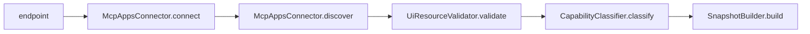

[]() 

# mcp-apps-validator

Validates MCP servers for UI extension (SEP-1865) support: connects via StreamableHTTP or SSE, discovers `ui://` resources, validates HTML content, CSP, permissions, display modes, theming, tool linkage, graceful degradation, measures latency, and returns a structured snapshot with 12 boolean categories and 18 entry fields.

## Quickstart

```bash
git clone https://github.com/FlowMCP/mcp-apps-validator.git
cd mcp-apps-validator
npm i
```

```javascript
import { McpAppsValidator } from 'mcp-apps-validator'

const { status, messages, categories, entries } = await McpAppsValidator.start( {
    endpoint: 'https://your-mcp-server.example.com/mcp',
    timeout: 15000
} )
```

## Features

- Connects to MCP servers via StreamableHTTP with SSE fallback
- Discovers `ui://` resources and tool-UI linkage via `_meta.ui.resourceUri`
- Validates HTML content of UI resources
- Checks CSP (Content Security Policy) configuration
- Validates permissions declarations
- Detects display mode support (embedded, panel, fullscreen, popup)
- Checks theme/style variable support
- Verifies graceful degradation with text fallbacks for non-UI hosts
- Classifies 12 boolean categories (reachable, MCP, MCP Apps, UI resources, tool linkage, theming, display modes)
- Measures listResources and readResource latency
- Compares two snapshots and produces a structured diff
- Returns empty snapshot with all-false categories on connection failure

## Architecture

The validation pipeline processes an MCP server in six sequential steps:



## Table of Contents

- [Methods](#methods)
  - [.start()](#start)
  - [.compare()](#compare)
- [Categories](#categories)
- [Entries](#entries)
- [License](#license)

## Methods

All methods are static. Parameters are passed as objects, return values are objects.

### `.start()`

Connects to an MCP server, discovers UI resources, validates HTML content, CSP, permissions, display modes, theming, tool linkage, measures latency, and returns a structured snapshot.

**Method**

```
.start( { endpoint, timeout } )
```

| Key | Type | Description | Required |
|-----|------|-------------|----------|
| endpoint | string | URL of the MCP server. Example `'https://server.example.com/mcp'` | Yes |
| timeout | number | Connection timeout in milliseconds. Default `10000` | No |

**Example**

```javascript
import { McpAppsValidator } from 'mcp-apps-validator'

const { status, messages, categories, entries } = await McpAppsValidator.start( {
    endpoint: 'https://your-mcp-server.example.com/mcp',
    timeout: 15000
} )

console.log( `Status: ${status ? 'PASS' : 'FAIL'}` )
console.log( `UI Resources: ${entries['uiResourceCount']}` )
console.log( `MCP Apps: ${categories['supportsMcpApps']}` )
console.log( `Extension: ${entries['extensionVersion']}` )
```

**Returns**

```javascript
{ status, messages, categories, entries }
```

| Key | Type | Description |
|-----|------|-------------|
| status | boolean | `true` when no messages were generated |
| messages | array of strings | Warning and error messages with error codes |
| categories | object | 12 boolean flags (see [Categories](#categories)) |
| entries | object | 18 data fields (see [Entries](#entries)) |

---

### `.compare()`

Compares two snapshots produced by `.start()` and returns a structured diff with added, removed, and modified items per section.

**Method**

```
.compare( { before, after } )
```

| Key | Type | Description | Required |
|-----|------|-------------|----------|
| before | object | Snapshot from a previous `.start()` call. Must contain `categories` and `entries` | Yes |
| after | object | Snapshot from a later `.start()` call. Must contain `categories` and `entries` | Yes |

**Example**

```javascript
import { McpAppsValidator } from 'mcp-apps-validator'

const before = await McpAppsValidator.start( { endpoint: 'https://server.example.com/mcp' } )
const after = await McpAppsValidator.start( { endpoint: 'https://server.example.com/mcp' } )

const { status, messages, hasChanges, diff } = McpAppsValidator.compare( { before, after } )

console.log( `Changes detected: ${hasChanges}` )
console.log( `UI resources added: ${diff['uiResources']['added'].length}` )
console.log( `UI resources removed: ${diff['uiResources']['removed'].length}` )
```

**Returns**

```javascript
{ status, messages, hasChanges, diff }
```

| Key | Type | Description |
|-----|------|-------------|
| status | boolean | `true` when comparison completed |
| messages | array of strings | Integrity warnings (URL mismatch, timestamp issues) |
| hasChanges | boolean | `true` when any diff section has changes |
| diff | object | Structured diff with sections: `server`, `uiResources`, `uiLinkedTools`, `csp`, `permissions`, `latency`, `categories` |

## Categories

12 boolean flags returned in `categories`:

| Key | Description |
|-----|-------------|
| isReachable | Server responded to connection attempt |
| supportsMcp | MCP handshake completed |
| supportsMcpApps | Server has `io.modelcontextprotocol/ui` extension |
| hasUiResources | At least one `ui://` resource discovered |
| hasUiToolLinkage | At least one tool has `_meta.ui.resourceUri` |
| hasValidUiHtml | UI resource contains valid HTML content |
| hasValidCsp | CSP configuration present on all validated resources |
| supportsTheming | Theme/style variables are supported |
| supportsDisplayModes | Display modes are declared |
| hasToolVisibility | Tool `_meta.ui.visibility` field is used |
| hasValidPermissions | No unknown permissions declared |
| hasGracefulDegradation | Text fallback available for non-UI hosts |

## Entries

18 data fields returned in `entries`:

| Key | Type | Description |
|-----|------|-------------|
| endpoint | string | MCP server endpoint URL that was validated |
| serverName | string | Server name from MCP handshake |
| serverVersion | string | Server version |
| serverDescription | string | Server description |
| protocolVersion | string | MCP protocol version |
| extensionVersion | string | `io.modelcontextprotocol/ui` extension version |
| capabilities | object | Raw server capabilities |
| uiResourceCount | number | Number of `ui://` resources discovered |
| uiResources | array | UI resources with uri, name, mimeType, hasCsp, hasPermissions, displayModes |
| uiLinkedToolCount | number | Number of tools linked to UI resources |
| uiLinkedTools | array | Tools with name, resourceUri, visibility |
| appOnlyToolCount | number | Tools with visibility `["app"]` only |
| cspSummary | object | `connectDomains`, `resourceDomains`, `frameDomains` |
| permissionsSummary | array | Aggregated permissions across all resources |
| displayModes | array | Aggregated display modes across all resources |
| tools | array | All discovered tools |
| resources | array | All discovered resources |
| latency | object | `listResources` and `readResource` in milliseconds |
| timestamp | string | ISO 8601 timestamp of validation |

## Validation Codes

### VAL — Input Validation

| Code | Severity | Description |
|------|----------|-------------|
| VAL-001 | ERROR | endpoint: Missing value |
| VAL-002 | ERROR | endpoint: Must be a string |
| VAL-003 | ERROR | endpoint: Must not be empty |
| VAL-004 | ERROR | endpoint: Must be a valid URL |
| VAL-005 | ERROR | timeout: Must be a number |
| VAL-006 | ERROR | timeout: Must be greater than 0 |
| VAL-010 | ERROR | before: Missing value |
| VAL-011 | ERROR | before: Must be an object |
| VAL-012 | ERROR | before: Missing categories or entries |
| VAL-013 | ERROR | after: Missing value |
| VAL-014 | ERROR | after: Must be an object |
| VAL-015 | ERROR | after: Missing categories or entries |

### CON — MCP Connection

| Code | Severity | Description |
|------|----------|-------------|
| CON-001 | ERROR | endpoint: Server is not reachable |
| CON-004 | ERROR | mcp: Initialize handshake failed |
| CON-008 | WARNING | tools/list: Request failed or invalid response format |
| CON-010 | WARNING | resources/list: Request failed |

### UIR — UI Resource Access

| Code | Severity | Description |
|------|----------|-------------|
| UIR-001 | WARNING | resources/read: Resource read failed |
| UIR-002 | WARNING | resources/read: Expected text/html content |

### UIV — UI Validation

| Code | Severity | Description |
|------|----------|-------------|
| UIV-010 | WARNING | HTML content is missing |
| UIV-011 | WARNING | HTML content is not a string |
| UIV-012 | WARNING | HTML content is empty |
| UIV-013 | WARNING | HTML content appears invalid |
| UIV-020 | WARNING | No CSP configuration declared |
| UIV-021 | WARNING | CSP domain should use https:// or wss:// |
| UIV-022 | WARNING | CSP contains wildcard domain |
| UIV-030 | WARNING | Unknown permissions declared |
| UIV-031 | WARNING | Sensitive permissions requested |
| UIV-040 | INFO | Unknown display modes |
| UIV-041 | INFO | No display modes declared |
| UIV-050 | INFO | No theming acknowledgment found |
| UIV-060 | WARNING | Tool references non-existent UI resource |
| UIV-061 | WARNING | Tool has invalid visibility values |
| UIV-062 | INFO | No tools linked to UI resources |
| UIV-063 | INFO | Tool has UI metadata but no resourceUri |
| UIV-070 | INFO | No graceful degradation found |
| UIV-080 | INFO | MCP Apps extension not declared |
| UIV-081 | INFO | Extension version not specified |

### CMP — Comparison

| Code | Severity | Description |
|------|----------|-------------|
| CMP-001 | WARNING | Snapshots are from different servers |
| CMP-002 | WARNING | Before snapshot has no timestamp |
| CMP-003 | WARNING | After snapshot is older than before |

## License

MIT
